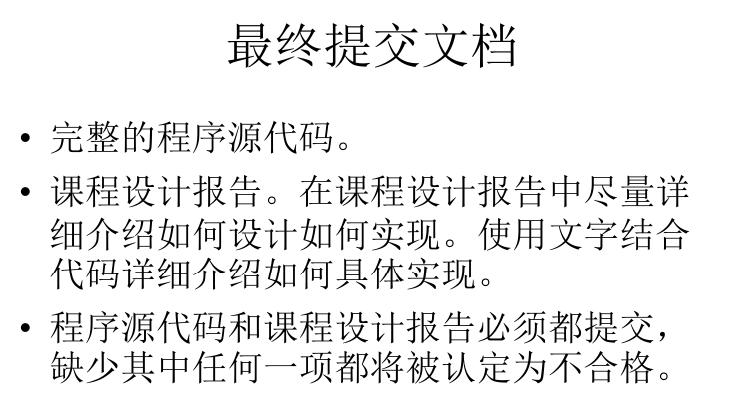

### Env

Compiler: java 17

maven archetype

> 这个游戏就是 poop 游戏..

### PS.
我写完后才发现自己可能理解错了, ship0, ship1两张图片是指同一个player的两个方向移动的图, 而不是指不同player

并且submarine里面的图片也是, 存在同一个submarine两个方向移动的图

正好就差异化了(, 所以大家完全可以根据我的改成正确的一个player和submarine两个方向移动的正确图片显示

并且我给出的framework里面并没有支持拓展多方向的动画储存, 可以略微修改一下应该就能复用, 我就懒得改了 (

### 自定义提示

首先推荐大家对各个package和class进行refactor, rename一下, 增加差异性.

因为要写报告:

`framework/` 提供了游戏底层大部分底层接口, 有时间并且愿意的话, 可以通过使用framework里面的class来自行实现进行差异化

次之, 可以修改`system/`里面的规则进行自定义化

也可以通过增加生命值/攻击力进行差异化

再次之, 通过修改`config/`里面的`Constants`的各个参数具体值来进行差异化 (但是具体海平面那个参数, 如果修改了窗口大小就需要修改SEA_LEVEL的大小, 可以在`test/` 里面运行`FrameworkTest`, 通过小方块的上边的显示坐标来调整具体还平面坐标)

当然完全一样我也是不介意的, 大家请自便

### 演示 poop

<video src="Images/QQ20251220-21494.mp4" controls=""></video>
见根目录下image/.MP4
